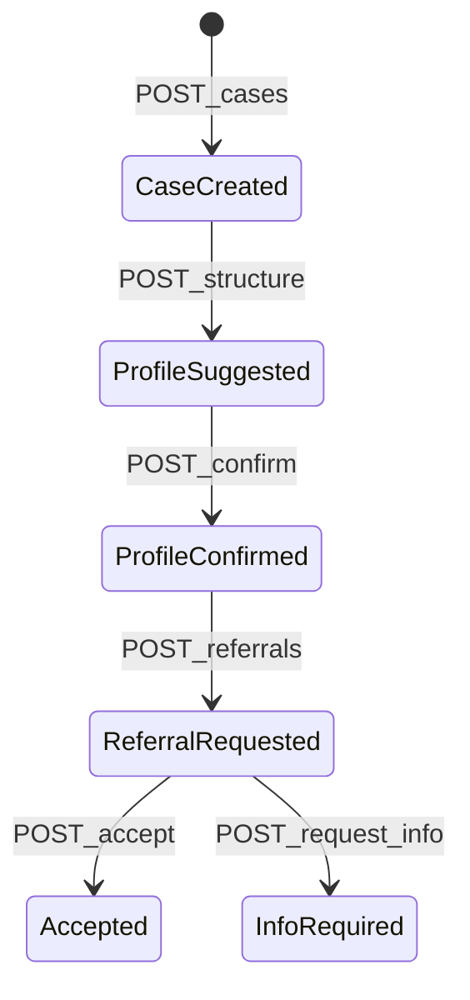

# MVP Screen + API Spec (Agent Contract)

에이전트 구현 정본. `AGENTS.md` API 목록과 1:1로 맞춘다.  
UI는 **페이지를 늘리지 말고 1화면 3열(또는 stepper)** 로 연결한다.

```text
교사 역할: Case 선택 → 메모 → AI → 확정 → 추천 → Referral
기관 역할: Referral 수락 / 정보요청 → Timeline 확인
```

---

## 1. 화면 구상 (Single Flow Workspace)

### 레이아웃

```text
┌────────────┬──────────────────────────┬─────────────────────┐
│ A. Cases   │ B. Workbench             │ C. Action / Timeline│
│ 목록+생성  │ 메모·AI·확정·추천        │ Referral·역할·이력  │
└────────────┴──────────────────────────┴─────────────────────┘
```

상단 고정: `역할 토글(교사 | 기관)` + 선택된 Case 가명 ID.

### 열별 역할

| 열 | 사용자 행동 | 호출 API | 게이트 |
|---|---|---|---|
| A | Case 생성 / 목록 선택 | `POST/GET /api/cases`, `GET /api/cases/:id` | 없음 |
| B1 | 상담 메모 입력 → 구조화 | `POST /api/cases/:id/structure` | Case 존재 |
| B2 | AI 제안 확인 후 urgency 확정 | `POST /api/cases/:id/profile/confirm` | structure 완료 |
| B3 | 추천 기관 확인 | `GET /api/cases/:id/recommendations` | **confirmedUrgency 존재** |
| C1 | Referral 생성 (교사) | `POST /api/referrals` | confirmed + 기관 선택 |
| C2 | ACCEPTED / INFO_REQUIRED (기관) | `POST .../accept`, `.../request-info` | referral REQUESTED |
| C3 | Timeline | `GET /api/referrals/:id/timeline` | referral 존재 |

### UI 규칙 (데모용)

- **AI 제안 vs 교사 확정**을 시각적으로 분리 (`suggestedUrgency` ≠ `confirmedUrgency`).
- HIGH 제안만으로는 추천/Referral CTA **비활성**.
- 추천 카드: `matchScore` + `matchReasons[]` 필수 표시.
- 기관 패널에는 **원문 note 미노출**. summary / needs / confirmedUrgency / consent 만.
- 가명만 표시: `student-demo-001`, `김○○`.

### 데모 클릭 순서 (발표)

```text
1. Case 생성(또는 seed 선택)
2. HIGH 유도 메모 입력 → 구조화
3. suggested HIGH 확인 → 교사 HIGH 확정
4. 추천 3개+ 확인(1위 근거 명확)
5. Referral 생성
6. 역할=기관 → ACCEPTED (또는 INFO_REQUIRED)
7. Timeline 이벤트 누적 확인
```

---

## 2. 공통 규약

### Base

- Base URL: `/api`
- Content-Type: `application/json`
- Demo actor: 헤더 `X-Demo-Role: teacher | organization` (Auth 생략)
- Demo user id: `demo-teacher-001` / `demo-org-staff-001`

### 에러 형식

```json
{ "error": { "code": "CONFIRMATION_REQUIRED", "message": "confirmedUrgency required" } }
```

| HTTP | code 예 |
|---|---|
| 400 | `VALIDATION_ERROR` |
| 404 | `NOT_FOUND` |
| 409 | `INVALID_STATE` |
| 422 | `CONFIRMATION_REQUIRED` |

### Urgency / Referral status

```text
Urgency: LOW | MEDIUM | HIGH
ReferralStatus: REQUESTED | ACCEPTED | INFO_REQUIRED
```

시간 부족 시 `INFO_REQUIRED` API 생략 가능. `REQUESTED → ACCEPTED`만 완성.

---

## 3. 데이터 모델 ↔ 응답 필드

6테이블만 사용.

| 테이블 | 핵심 필드 |
|---|---|
| `organizations` | id, name, region, ageMin, ageMax, emergencyCapable, availability |
| `services` | id, organizationId, needTags[] |
| `cases` | id, alias, ageBand, region, note?(교사 전용), consentStatus, createdAt |
| `case_profiles` | caseId, summary, riskTypes[], needs[], suggestedUrgency, confirmedUrgency?, confirmedAt? |
| `referrals` | id, caseId, organizationId, status, createdAt |
| `referral_logs` | id, referralId, fromStatus?, toStatus, actorRole, meta?, createdAt |

`note`는 structure 입력용. **recommendations / referrals / timeline 응답에 note 넣지 않음.**

---

## 4. API 명세

구현 순서: **Case 3개 → structure/confirm → recommendations → referrals/timeline**.

### 4.1 `POST /api/cases`

Case 생성.

**Request**

```json
{
  "alias": "student-demo-001",
  "ageBand": "13-18",
  "region": "강남구",
  "consentStatus": "guardian_pending"
}
```

**Response `201`**

```json
{
  "id": "uuid",
  "alias": "student-demo-001",
  "ageBand": "13-18",
  "region": "강남구",
  "consentStatus": "guardian_pending",
  "createdAt": "ISO-8601"
}
```

**화면:** A열 「새 사례」.

---

### 4.2 `GET /api/cases`

목록.

**Response `200`**

```json
{
  "items": [
    {
      "id": "uuid",
      "alias": "student-demo-001",
      "ageBand": "13-18",
      "region": "강남구",
      "hasProfile": false,
      "confirmedUrgency": null,
      "createdAt": "ISO-8601"
    }
  ]
}
```

**화면:** A열 리스트. `confirmedUrgency`로 배지 표시.

---

### 4.3 `GET /api/cases/:id`

상세 (교사 워크벤치 로드).

**Response `200`**

```json
{
  "id": "uuid",
  "alias": "김○○",
  "ageBand": "13-18",
  "region": "강남구",
  "consentStatus": "guardian_pending",
  "note": "교사 전용 — 목록/기관 응답에 복제 금지",
  "profile": null,
  "createdAt": "ISO-8601"
}
```

`profile`이 있으면:

```json
"profile": {
  "summary": "결석 증가와 또래 갈등, 수면 어려움이 보고됨",
  "riskTypes": ["학교중단", "대인관계", "정신건강"],
  "needs": ["심리상담", "학교적응"],
  "suggestedUrgency": "HIGH",
  "confirmedUrgency": null,
  "confirmedAt": null
}
```

**화면:** B열 초기 상태.

---

### 4.4 `POST /api/cases/:id/structure`

상담 메모 → AI 구조화 (mock 허용).

**Request**

```json
{
  "note": "요즘 결석이 늘고 학교 가기 싫어한다고 함. 친구랑 다툰 뒤 잠을 못 자고 힘들어함."
}
```

**Response `200`**

```json
{
  "caseId": "uuid",
  "profile": {
    "summary": "결석 증가, 또래 갈등, 수면 문제 — HIGH 검토 제안",
    "riskTypes": ["학교중단", "대인관계", "정신건강"],
    "needs": ["심리상담", "학교적응"],
    "suggestedUrgency": "HIGH",
    "confirmedUrgency": null,
    "confirmedAt": null
  },
  "provider": "mock"
}
```

**규칙**

- 키워드(`결석`, `학교 가기 싫`, `친구`, `잠을 못`, `힘들어`) → `suggestedUrgency: HIGH` 가능.
- **확정 아님.** Referral 게이트 미개방.
- 응답에 raw prompt 포함 금지.

**화면:** B1 「AI 분석」카드. suggested 배지 강조.

---

### 4.5 `POST /api/cases/:id/profile/confirm`

교사 urgency 확정.

**Request**

```json
{
  "confirmedUrgency": "HIGH",
  "needs": ["심리상담", "학교적응"],
  "consentStatus": "guardian_granted"
}
```

**Response `200`**

```json
{
  "caseId": "uuid",
  "profile": {
    "summary": "...",
    "riskTypes": ["학교중단", "대인관계", "정신건강"],
    "needs": ["심리상담", "학교적응"],
    "suggestedUrgency": "HIGH",
    "confirmedUrgency": "HIGH",
    "confirmedAt": "ISO-8601"
  },
  "consentStatus": "guardian_granted"
}
```

**에러 `422 CONFIRMATION_REQUIRED`:** profile(structure) 없음.  
**화면:** B2. 확정 후 B3·C1 CTA 활성화.

---

### 4.6 `GET /api/cases/:id/recommendations`

기관 추천 (규칙 기반).

**사전조건:** `confirmedUrgency` 필수. 없으면 `422`.

**Response `200`**

```json
{
  "caseId": "uuid",
  "items": [
    {
      "organizationId": "org-a",
      "name": "강남 청소년상담복지센터",
      "region": "강남구",
      "availability": "AVAILABLE",
      "emergencyCapable": true,
      "matchedServices": ["심리상담"],
      "matchScore": 92,
      "matchReasons": [
        "지역 일치: 강남구",
        "연령 범위 일치: 13-24",
        "need 일치: 심리상담",
        "긴급 지원 가능",
        "availability: AVAILABLE"
      ]
    }
  ]
}
```

**점수 힌트 (구현용)**

```text
지역 +30 | 연령 +20 | need/service +25 | emergency(HIGH일 때) +15 | AVAILABLE +10 | WAITLIST -10
```

정렬: `matchScore` 내림차순. 최소 3개 반환(시드 기준).  
**응답에 note 금지.**  
**화면:** B3 추천 카드 리스트.

---

### 4.7 `POST /api/referrals`

의뢰 생성.

**Request**

```json
{
  "caseId": "uuid",
  "organizationId": "org-a"
}
```

**사전조건:** confirmedUrgency 존재. 없으면 `422`.

**Response `201`**

```json
{
  "id": "uuid",
  "caseId": "uuid",
  "organizationId": "org-a",
  "status": "REQUESTED",
  "payload": {
    "alias": "student-demo-001",
    "ageBand": "13-18",
    "region": "강남구",
    "summary": "...",
    "confirmedUrgency": "HIGH",
    "needs": ["심리상담"],
    "consentStatus": "guardian_granted"
  },
  "createdAt": "ISO-8601"
}
```

생성 시 `referral_logs`에 `toStatus=REQUESTED` 기록.  
**화면:** C1. 생성 후 Timeline 갱신.

---

### 4.8 `POST /api/referrals/:id/accept`

기관 수락. `X-Demo-Role: organization`.

**Response `200`**

```json
{
  "id": "uuid",
  "status": "ACCEPTED",
  "updatedAt": "ISO-8601"
}
```

`REQUESTED → ACCEPTED`만 허용. 그 외 `409 INVALID_STATE`.  
로그 필수.  
**화면:** C2 「수락」.

---

### 4.9 `POST /api/referrals/:id/request-info` (시간 부족 시 생략 가능)

**Request**

```json
{ "message": "보호자 동의 서류 확인 필요" }
```

**Response `200`**

```json
{
  "id": "uuid",
  "status": "INFO_REQUIRED",
  "updatedAt": "ISO-8601"
}
```

`message`는 log meta에만. timeline에 상담 원문 복제 금지.  
**화면:** C2 「추가정보 요청」.

---

### 4.10 `GET /api/referrals/:id/timeline`

**Response `200`**

```json
{
  "referralId": "uuid",
  "status": "ACCEPTED",
  "events": [
    {
      "id": "uuid",
      "toStatus": "REQUESTED",
      "actorRole": "teacher",
      "meta": { "organizationId": "org-a" },
      "createdAt": "ISO-8601"
    },
    {
      "id": "uuid",
      "fromStatus": "REQUESTED",
      "toStatus": "ACCEPTED",
      "actorRole": "organization",
      "meta": {},
      "createdAt": "ISO-8601"
    }
  ]
}
```

시간순 오름차순. note / AI raw 금지.  
**화면:** C3 Timeline.

---

## 5. 상태 머신 (최소)



---

## 6. 에이전트 구현 체크 (이 문서 기준)

```text
[ ] schema 6테이블 + seed
[ ] Case API 3 (create/list/get) smoke
[ ] structure + confirm (suggested≠confirmed)
[ ] recommendations (score+reasons, confirm 게이트)
[ ] referrals + accept (+ optional request-info)
[ ] timeline logs
[ ] 1화면 3열 UI 연결
[ ] 원문 note 기관 응답 미포함
```

첫 구현 프롬프트용 한 줄:

```text
docs/MVP_SCREEN_AND_API.md 를 정본으로 schema → Case API 3개부터 구현하고,
각 단계 후 최소 검증을 실행하라. 화면은 1워크스페이스 3열로만 연결한다.
```
